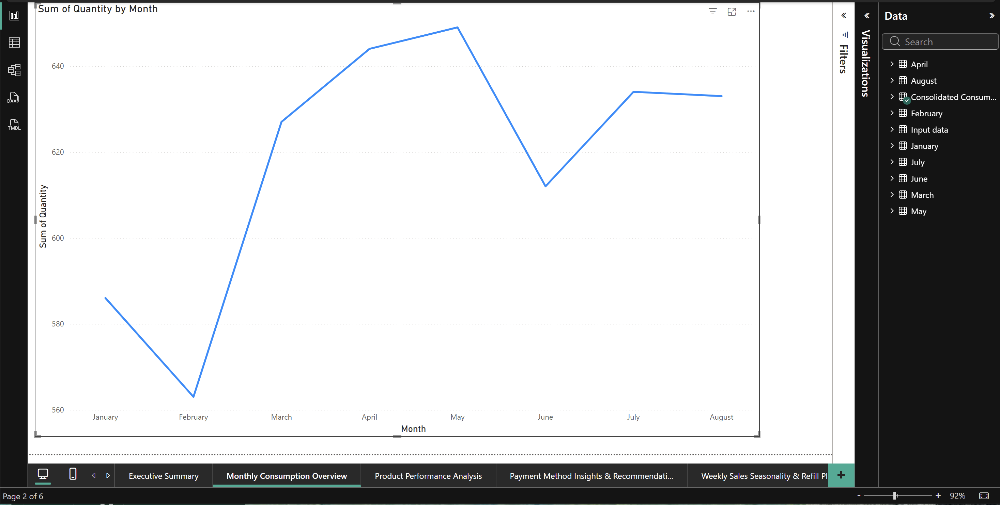
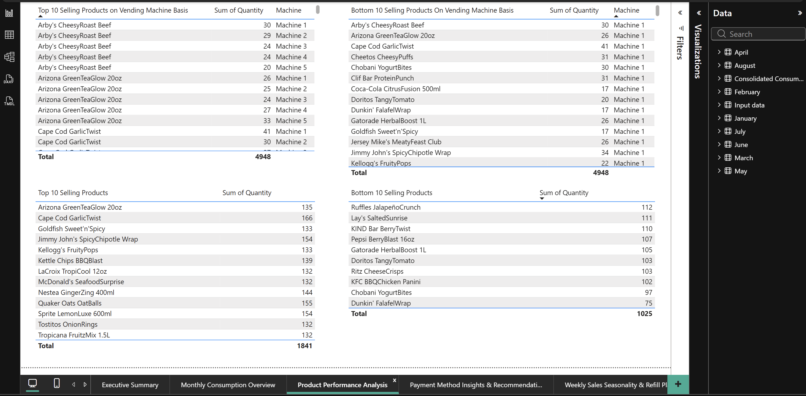

# Aumovio-powerbi-technical-assessment
Power BI data analytics dashboard created as a technical assessment for a Data Analytics internship at AUMOVIO.

# Power BI Vending Machine Consumption Dashboard — AUMOVIO (Technical Assessment)

This repository contains a Power BI report developed as part of a **technical assessment** for a **Data Analytics / Business Intelligence internship** at **AUMOVIO**.

The goal of the assessment was to analyze vending machine consumption data (January–August) across multiple locations and provide **data-driven recommendations** to optimize product stocking, payment system setup, and inventory refilling schedules.

---

## 📊 Key Analytical Objectives

1️⃣ **Monthly Consumption Overview**  
Analyze total sales trends over time to understand demand growth and seasonal variation.

2️⃣ **Product Performance Analysis**  
Identify **Top 10 & Bottom 10** products at vending machine and overall level to support product assortment optimization.

3️⃣ **Payment Method Insights & Recommendation**  
Evaluate customer payment behavior (**credit**, **cash**, **mobile**) and propose suitable terminal types for future installations.

4️⃣ **Weekly Sales Seasonality & Inventory Strategy**  
Determine **peak demand days** and recommend an **optimal twice-per-week refill schedule**.

5️⃣ **Revenue & Pricing Analysis**  
Calculate and compare **revenue**, **sales volume**, and **average selling price** across categories and products.

---

## 🧠 Key Insights Delivered

✔ Consumption increased steadily from February to May indicating positive demand momentum.  
✔ **Card and cash** were dominant payment modes (~78%), with mobile contributing ~22%.  
✔ Certain snacks and drink products consistently ranked among the **top sellers**, while others showed low sales suggesting **rationalization opportunities**.  
✔ Highest sales occurred on **Wednesday, Thursday, and Sunday** → Recommended **refill on Tue/Wed + Saturday morning**.  
✔ Product-level ASP analysis enabled prioritizing items with strong **value performance**.

These insights support **operational**, **pricing**, and **deployment** decisions.

---

## 🛠️ Tools & Skills Demonstrated

| Skill Area | Techniques Used |
|----------|----------------|
| Data Modeling | Relationship modeling across monthly sheets |
| ETL / Cleaning | Power Query transformations |
| KPI Computation | DAX measures: Revenue, Avg. Price, Units Sold |
| Visualization | Line charts, bar charts, tables, pie charts |
| Business Communication | Executive summary + actionable recommendations |

---

## 📷 Dashboard Preview

### 📝 Executive Summary
Shows analysis goals, approach, and strategic recommendations.

---

### 📈 Monthly Consumption Trends
Trend analysis of overall consumption (Jan–Aug).

---

### 🥇 Top vs Bottom Performing Products
Analysis to support product stocking decisions.

---

### 📅 Weekly Sales & Refill Strategy
Peak-day analysis and inventory optimization recommendations.

---

## 📂 Repository Structure

